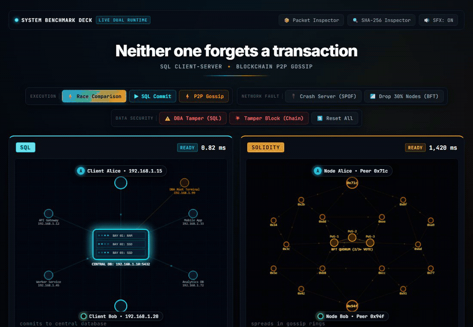

# 🌐 Blockchain Engineering Labs

[](https://github.com/tungcorn/blockchain-engineering-labs)
[](https://soliditylang.org/)
[](LICENSE)
[](README.md)

A comprehensive, engineering-focused curriculum exploring **Blockchain architecture, distributed systems, consensus protocols, cryptography, and smart contract development**.

---

## 📚 Curriculum Roadmap & Lab Directory

| Lab | Topic | Focus Area | Status |
| :--- | :--- | :--- | :---: |
| **[Lab 01](lab01-blockchain-vs-sql/)** | **Blockchain vs SQL • Architectural Simulation** | Network Topologies, SPOF vs BFT, Data Immutability, SHA-256 Avalanche | 🟢 Complete |
| **Lab 02** | **Solidity Fundamentals & Gas Optimization** | EVM Storage Slots, Reentrancy Guards, Custom Errors, Gas Benchmarks | 🟡 Upcoming |
| **Lab 03** | **Tokens, Staking Pools & DeFi Primitives** | ERC-20, Staking Rewards Algorithm, Automated Market Makers (AMM) | ⚪ Planned |
| **Lab 04** | **NFTs & Decentralized Storage** | ERC-721A, IPFS / Filecoin Pinning, Merkle Tree Whitelist Airdrops | ⚪ Planned |
| **Capstone** | **Fullstack Decentralized Application (DApp)** | Next.js, Wagmi/Viem, Hardhat/Foundry, Testnet Deployment | ⚪ Planned |

---

## ⚡ Featured Showcase: Lab 01

### 🔬 [Lab 01 • Blockchain vs SQL Visualizer](lab01-blockchain-vs-sql/)
An interactive side-by-side simulator contrasting **Centralized Client-Server Databases (Star Topology)** with **Decentralized Peer-to-Peer Blockchains (Gossip Mesh)**.

<p align="center">
  
</p>

* **Core Highlights**:
  * ⚡ **Race Comparison**: 0.82 ms direct TCP commit vs 1,420 ms decentralized gossip consensus.
  * 🔌 **SPOF Crash vs BFT Partition**: Proving why client-server dies on single host failure, while P2P mesh survives 30%+ node outage.
  * ⚠️ **DBA Silent Overwrite vs Cryptographic Tamper**: Exposing why central databases blindly trust root admins, while 14,574 blockchain peers immediately reject altered blocks.
  * 📦 **Deep-dive Wireshark & SHA-256 Diagnostics**: Raw TCP socket frames vs DevP2P RLPx encrypted packets.

👉 **[Launch Lab 01 Interactive Web App](lab01-blockchain-vs-sql/demo/index.html)** | **[Read Detailed Lab 01 Writeup](lab01-blockchain-vs-sql/README.md)**

---

## 🛠️ Technology Stack & Tools

* **Core Languages**: Solidity (`^0.8.20`), JavaScript (ES2024), SQL (PostgreSQL / MySQL)
* **Cryptographic Primitives**: SHA-256, Keccak-256, ECDSA (`secp256k1`), Merkle Trees
* **Distributed Networking**: DevP2P, RLPx Framing, TCP/IP Stream Sockets
* **Development & Tooling**: Node.js, Web Audio API, HTML5 Canvas, ffmpeg

---

## 🚀 Getting Started

Clone the repository and explore any lab module:

```bash
git clone https://github.com/tungcorn/blockchain-engineering-labs.git
cd blockchain-engineering-labs

# Run Lab 01 Interactive Web Visualizer
cd lab01-blockchain-vs-sql
npx serve demo
```

---

## 📄 License
This repository is licensed under the [MIT License](LICENSE).
