# Blockchain vs SQL • Architecture & Visual Simulation

An interactive visual comparison between **Centralized Client-Server Databases (SQL)** and **Decentralized Peer-to-Peer Blockchains (Solidity)**.

<p align="center">
  
</p>

<p align="center">
  <a href="demo/index.html">
    
  </a>
  <a href="contracts/SimpleBank.sol">
    
  </a>
  <a href="sql/schema.sql">
    
  </a>
</p>

---

## ⚡ Quick Start

### 1. Web Visualizer (Interactive Demo)
Open [`demo/index.html`](demo/index.html) in any modern web browser (Chrome, Edge, Firefox), or serve locally:
```bash
npx serve demo
```

### 2. CLI Cryptography Simulation
Simulate SHA-256 block hashing, the Avalanche Effect, and ledger tamper detection via CLI:
```bash
node scripts/simulate.js
```

---

## ⚖️ Core Architectural Comparison

| Dimension | Centralized SQL (RDBMS) | Decentralized Blockchain (Solidity) |
| :--- | :--- | :--- |
| **Network Topology** | **Client-Server (Star)**: Clients establish direct TCP sockets (Port 5432) to one central database server. | **P2P Mesh (Decentralized)**: Independent validator and peer nodes propagate transactions via Gossip protocol. |
| **Fault Tolerance** | **Single Point of Failure (SPOF)**: If the central server crashes, all clients fail with `ECONNREFUSED`. | **Byzantine Fault Tolerance (BFT)**: The mesh survives even if 30%+ of nodes drop offline without downtime. |
| **Governance & Trust** | **Centralized Authority**: DBA root privileges allow silent `UPDATE` or `DELETE` memory mutations. | **Trustless & Code is Law**: Cryptographically signed via ECDSA private keys; past blocks cannot be forged. |
| **Data Storage Model** | **CRUD (In-place Mutation)**: Directly overwrites current database cell values. | **Append-only (Chained Ledger)**: New blocks linked sequentially via SHA-256 cryptographic hashes. |
| **Latency vs Security** | Extremely fast (< 1 ms, 10,000+ TPS). | Trade-off: Higher latency (~1-2s consensus) in exchange for absolute immutability and provenance. |

---

## 📂 Project Structure

```text
├── demo/                       # Interactive side-by-side visualizer (HTML/CSS/JS)
├── contracts/                  # Solidity smart contracts (SimpleBank, NotaryRegistry)
├── sql/                        # SQL relational schemas and comparison queries
├── scripts/                    # Cryptographic simulation scripts (simulate.js)
└── README.md                   # Project documentation
```
